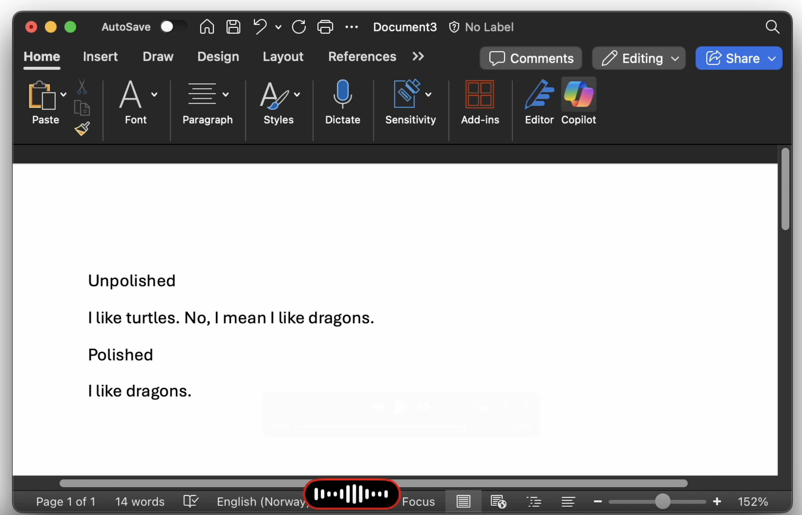

<p align="center"><strong>Utter</strong> is a macOS overlay to easily dictate text.

<p align="center">
  
</p>

> [!WARNING]
> This is an early prototype. It is very unstable.

Press and hold Fn to record, release to transcribe and paste. Enter your own groq api key and use. It also has an option to polish the transcript through another LLM. Wispr flow inspired.

## Features

- **Fn key activation** - Hold Fn to record, release to transcribe
- **Menu bar UI** - Minimal floating window with audio visualization
- **BYOK** - Groq API used for Wispher and GPT-OSS-120B.
- **Optional polish** - Clean up transcripts with AI

## Requirements

- macOS 12+
- Groq API key ([get one here](https://console.groq.com))

## Installation

```bash
swift build -c release
cp .build/release/utter /usr/local/bin/
```

Or run directly:

```bash
swift run
```

## Setup

1. Launch the app (it appears in your menu bar)
2. Click the menu bar icon and select "Set API Key..."
3. Enter your Groq API key
4. Grant Accessibility and Microphone permissions when prompted
5. It may prompt for keychain password, make sure to "Always allow"

## Usage

1. Hold the **Fn** key to start recording
2. Speak your text
3. Release **Fn** to transcribe
4. Text is automatically pasted at your cursor

Toggle "Polish transcript" in the menu to have the AI clean up filler words and improve formatting.

## License

MIT

## Known issues

- [ ] non-existent UX for errors. silently fails if you don't have internet, etc.
- [ ] audio ducking when activated.
